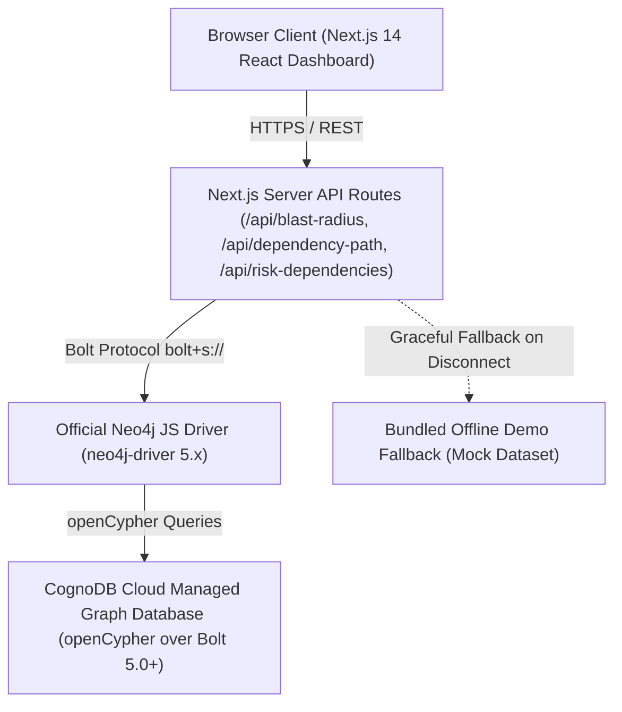
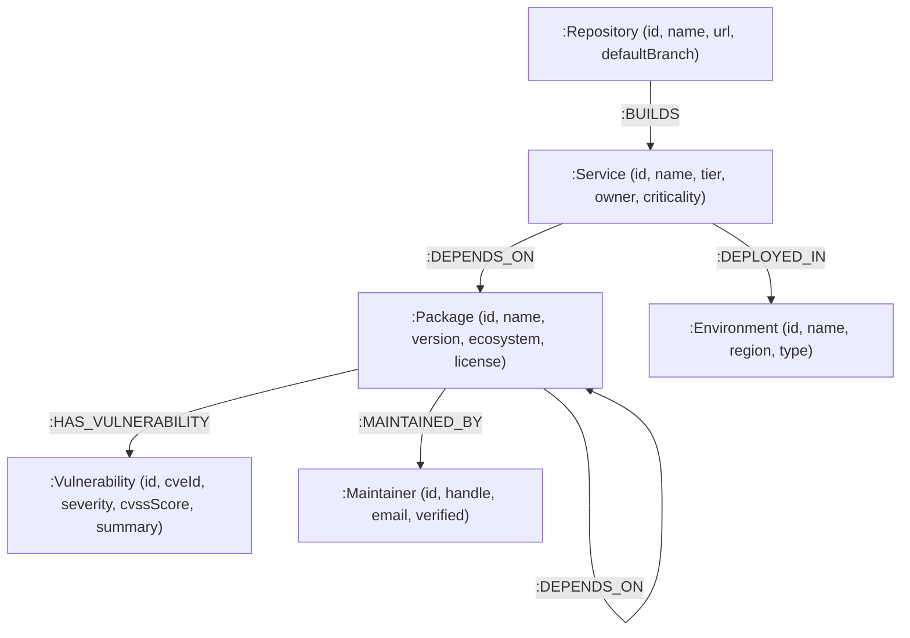

# NexusGraph — Software Supply Chain & Vulnerability Intelligence

> **Wexa AI Take-Home Assessment (Software Engineer — Full-Stack / Web)**  
> **Candidate**: Dattatreya Teella  
> **Database Layer**: CognoDB Cloud (openCypher over Bolt protocol via official `neo4j-driver`)  
> **Hosted Live Demo**: [https://cognodb-database-layer.onrender.com/](https://cognodb-database-layer.onrender.com/)

---

## 1. Product Overview

**NexusGraph** is a production-grade software supply chain security platform backed by a managed graph database (**CognoDB Cloud**). It enables security engineers, platform leads, and developers to visually investigate how zero-day vulnerabilities (CVEs) or compromised open-source packages propagate across multi-hop transitive dependency trees to affect enterprise production microservices.

```
Vulnerability ──> Vulnerable Package ──> Dependency Chain (1-5 Hops) ──> Affected Services ──> Production Impact
```

---

## 2. The Problem

Modern cloud software consists of microservices built on deep dependency trees. Service A depends on Package B, which depends on Package C, which transitively depends on Package D. When a critical security vulnerability occurs (e.g., **Log4Shell - CVE-2021-44228** or **XZ Utils Backdoor - CVE-2024-3094**), engineering teams must rapidly answer:

1. *Which production microservices are affected directly or transitively?*
2. *What is the exact multi-hop dependency path connecting the service to the vulnerable package?*
3. *How many hops away is the vulnerability?*
4. *Which environments (Production vs Staging) are exposed?*
5. *Which packages represent high-impact concentration risk across our ecosystem?*

NexusGraph answers these questions in real time using parameterized Cypher graph queries and an interactive graph visualizer.

---

## 3. Why a Graph Database? (Graph DB vs. Relational Schema)

The core product questions of software supply chain security are fundamentally **relationship-centric**. The value comes from the structure and depth of connections, not merely from storing entities in tabular rows.

### Relational Database (SQL) Considerations:
- **Transitive Dependency Traversals**: Representing variable-depth transitive dependencies in a relational schema requires recursive Common Table Expressions (CTEs), repeated self-JOINs, or application-level recursive fetching (`JOIN package_deps ON ...`).
- **Path Discovery Complexity**: Formulating queries to extract the complete visual path nodes between a microservice and a target package in SQL requires verbose array aggregations and string stitching across CTE iterations.

### Graph Database (CognoDB / openCypher) Advantages:
- **Relationship-First Data Model**: Relationships are first-class entities. Traversal across variable-length paths is expressed naturally in openCypher without complex SQL join syntax.
- **Expressive Multi-Hop Cypher Syntax**: A 1-to-5 hop transitive dependency traversal is written concisely:
  ```cypher
  MATCH path = (s:Service)-[:DEPENDS_ON*1..5]->(p:Package)-[:HAS_VULNERABILITY]->(v:Vulnerability {cveId: $cveId})
  RETURN s, p, v, length(path) - 1 AS hopDistance
  ```
- **Native Path Functions**: Graph operations such as `shortestPath()` locate dependency chains directly without custom recursive logic.

*Key Justification*: A graph database earns its place in NexusGraph because the core domain models software supply chains as interconnected networks where paths, transitive relationships, and downstream impact are the central focus.

---

## 4. System Architecture



---

## 5. Graph Data Model



### Node Labels & Schema Definition

| Node Label | Key Properties | Description |
| :--- | :--- | :--- |
| `:Service` | `id`, `name`, `tier`, `owner`, `criticality` | Enterprise microservices (`payment-service`, `checkout-service`) |
| `:Package` | `id`, `name`, `version`, `ecosystem`, `license` | Software packages (`log4j-core`, `express`, `xz-utils`) |
| `:Vulnerability` | `id`, `cveId`, `severity`, `cvssScore`, `summary` | Security vulnerabilities (`CVE-2021-44228`, `CVE-2024-3094`) |
| `:Maintainer` | `id`, `handle`, `email`, `verified` | Open-source package maintainers or foundations |
| `:Repository` | `id`, `name`, `url`, `defaultBranch` | Source git repositories building microservices |
| `:Environment` | `id`, `name`, `region`, `type` | Deployment targets (`production-us-east`, `staging-global`) |

---

## 6. Core Parameterized Cypher Queries

### 1. Multi-Hop Vulnerability Blast Radius Query (2–5 Hops)
*Finds all production microservices transitively affected by a specific CVE across 1 to 5 dependency hops, returning the exact path nodes and hop distance.*

```cypher
MATCH path = (s:Service)-[:DEPENDS_ON*1..5]->(p:Package)-[:HAS_VULNERABILITY]->(v:Vulnerability {cveId: $cveId})
OPTIONAL MATCH (s)-[:DEPLOYED_IN]->(e:Environment)
RETURN 
  s.id AS serviceId,
  s.name AS serviceName,
  s.tier AS tier,
  coalesce(e.name, 'production-us-east') AS environment,
  coalesce(e.type, 'production') AS envType,
  p.name AS vulnerablePackage,
  p.version AS version,
  v.cveId AS cveId,
  v.summary AS summary,
  v.severity AS severity,
  v.cvssScore AS cvssScore,
  [node IN nodes(path) | {
    id: coalesce(node.id, node.name, node.cveId),
    label: labels(node)[0],
    name: coalesce(node.name, node.cveId)
  }] AS pathNodes,
  length(path) - 1 AS hopDistance
ORDER BY hopDistance ASC, s.tier DESC
```

### 2. Dependency Path Finder (Shortest Path Query)
*Calculates the shortest dependency chain between any microservice and target package.*

```cypher
MATCH (s:Service {name: $serviceName}), (p:Package {name: $packageName})
MATCH path = shortestPath((s)-[:DEPENDS_ON*1..10]->(p))
OPTIONAL MATCH (p)-[:HAS_VULNERABILITY]->(v:Vulnerability)
RETURN 
  s.name AS serviceName,
  p.name AS packageName,
  [node IN nodes(path) | {
    id: coalesce(node.id, node.name),
    label: labels(node)[0],
    name: coalesce(node.name, node.cveId),
    version: node.version
  }] AS pathNodes,
  length(path) AS hopDistance,
  collect(DISTINCT { cveId: v.cveId, severity: v.severity, cvssScore: v.cvssScore }) AS vulns
```

### 3. High-Impact Vulnerable Dependencies (Downstream Impact Ranking)
*Identifies packages with CRITICAL or HIGH vulnerabilities affecting the largest number of production microservices.*

```cypher
MATCH (s:Service)-[:DEPENDS_ON*1..5]->(p:Package)-[:HAS_VULNERABILITY]->(v:Vulnerability)
WHERE v.severity IN ['CRITICAL', 'HIGH']
OPTIONAL MATCH (s)-[:DEPLOYED_IN]->(e:Environment)
WITH p, v, s, e
WITH p, v,
     count(DISTINCT s) AS affectedServicesCount,
     count(DISTINCT CASE WHEN e.type = 'production' OR e.name CONTAINS 'prod' THEN s END) AS prodServicesCount
RETURN 
  p.name AS packageName,
  p.version AS version,
  p.ecosystem AS ecosystem,
  v.cveId AS cveId,
  v.severity AS severity,
  v.cvssScore AS cvssScore,
  affectedServicesCount,
  prodServicesCount
ORDER BY prodServicesCount DESC, affectedServicesCount DESC
LIMIT 10
```

---

## 7. Local Setup & Installation Guide

### Prerequisites
- Node.js 18.x or 20.x
- npm / yarn / pnpm

### Step 1: Clone Repository & Install Dependencies
```bash
git clone https://github.com/dattu-codes/CognoDB_database_layer.git
cd CognoDB_database_layer
npm install
```

### Step 2: Provision CognoDB Cloud Instance
1. Go to [https://console.cognodb.com/signup](https://console.cognodb.com/signup) and create a free account (No credit card required).
2. Create a free **c0** instance and select your region.
3. Save the connection URI (e.g. `bolt+s://<instance-id>.databases.cognodb.cloud`) and generated password for user `cognodb`.

### Step 3: Configure Environment Variables
Create `.env.local` in the root directory:
```env
COGNODB_URI=bolt+s://your-instance-id.databases.cognodb.cloud
COGNODB_USERNAME=cognodb
COGNODB_PASSWORD=your-generated-password
```

### Step 4: Run Automated Graph Data Seeder
Populate CognoDB Cloud with synthetic microservice, package, CVE, and dependency graph data:
```bash
npx tsx scripts/seed.ts
```

### Step 5: Start Local Development Server
```bash
npm run dev
```
Open [http://localhost:3000](http://localhost:3000) in your browser.

---

## 8. Synthetic Demonstration Dataset Notice

> [!NOTE]
> All services, repositories, environments, and package relationship topologies in this database are **synthetic demonstration data** created for evaluation of graph data modeling and Cypher query execution in the Wexa AI Take-Home Assessment. CVE numbers (e.g. `CVE-2021-44228`, `CVE-2024-3094`) and package names refer to real-world security vulnerabilities used strictly as realistic evaluation identifiers.

---

## 9. Graceful Demo Fallback Mode

If environment credentials are missing or the CognoDB database is unreachable:
- NexusGraph automatically degrades gracefully into **Demo Fallback Mode**: `● DEMO MODE — Cached Dataset`.
- Features a bundled realistic graph dataset so evaluators can test all UI workflows seamlessly.
- When connected to live CognoDB Cloud, displays `● LIVE — CognoDB Cloud`.

---

## 10. Wexa AI Requirement Mapping Table

| Requirement | Implementation Detail | Location in Codebase |
| :--- | :--- | :--- |
| **Graph Database Layer** | CognoDB Cloud openCypher over Bolt 5.0+ | [`src/lib/cognodb.ts`](file:///C:/Users/datta/.gemini/antigravity-ide/scratch/wexa-cognodb-graph-app/src/lib/cognodb.ts) |
| **Official Neo4j Driver** | `neo4j-driver` pool & sessions | [`src/lib/cognodb.ts`](file:///C:/Users/datta/.gemini/antigravity-ide/scratch/wexa-cognodb-graph-app/src/lib/cognodb.ts) |
| **Graph Data Model** | Service, Package, Vulnerability, Maintainer, Repo, Env | [`src/lib/types.ts`](file:///C:/Users/datta/.gemini/antigravity-ide/scratch/wexa-cognodb-graph-app/src/lib/types.ts) |
| **Executable Seed Script** | `scripts/seed.ts` + 1-Click UI API seeder | [`scripts/seed.ts`](file:///C:/Users/datta/.gemini/antigravity-ide/scratch/wexa-cognodb-graph-app/scripts/seed.ts) |
| **2+ Hop Traversal** | `(s:Service)-[:DEPENDS_ON*1..5]->(p:Package)-[:HAS_VULNERABILITY]->(v)` | [`src/lib/cypher.ts`](file:///C:/Users/datta/.gemini/antigravity-ide/scratch/wexa-cognodb-graph-app/src/lib/cypher.ts#L45-L75) |
| **Relational-Awkward Query** | Transitive CVE blast-radius & shortest dependency path | [`src/lib/cypher.ts`](file:///C:/Users/datta/.gemini/antigravity-ide/scratch/wexa-cognodb-graph-app/src/lib/cypher.ts) |
| **Parameterized Queries** | All dynamic inputs parameterized (`$cveId`, `$serviceName`) | [`src/lib/cypher.ts`](file:///C:/Users/datta/.gemini/antigravity-ide/scratch/wexa-cognodb-graph-app/src/lib/cypher.ts) |
| **No Arbitrary Cypher API** | Controlled API endpoints (`/api/blast-radius`, `/api/dependency-path`) | [`src/app/api/blast-radius/route.ts`](file:///C:/Users/datta/.gemini/antigravity-ide/scratch/wexa-cognodb-graph-app/src/app/api/blast-radius/route.ts) |
| **UI/UX Excellence** | Glassmorphism dark developer UI, canvas visualizer, inspector | [`src/app/page.tsx`](file:///C:/Users/datta/.gemini/antigravity-ide/scratch/wexa-cognodb-graph-app/src/app/page.tsx) |
| **Loading / Empty / Error States** | Handled explicitly across components | [`src/components/BlastRadiusPanel.tsx`](file:///C:/Users/datta/.gemini/antigravity-ide/scratch/wexa-cognodb-graph-app/src/components/BlastRadiusPanel.tsx) |
| **Graceful Unreachable Handling** | Automatic switch to Demo Fallback dataset | [`src/lib/cognodb.ts`](file:///C:/Users/datta/.gemini/antigravity-ide/scratch/wexa-cognodb-graph-app/src/lib/cognodb.ts#L25-L65) |
| **Secret Management** | Credentials read from `.env.local`, never committed | [`.env.example`](file:///C:/Users/datta/.gemini/antigravity-ide/scratch/wexa-cognodb-graph-app/.env.example) |
| **Hosted Live Demo** | Render production deployment | [https://cognodb-database-layer.onrender.com/](https://cognodb-database-layer.onrender.com/) |
